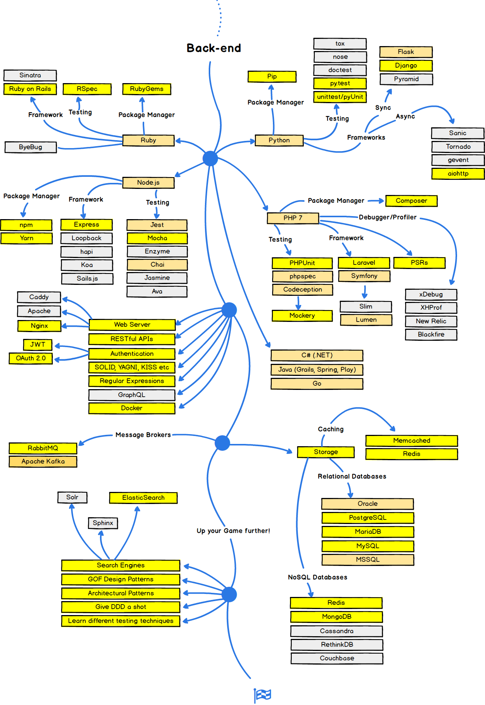

# Web-Front-End-Programming-Basic-Class, 나만의 이력서 만들기
Learn HTML/CSS, while creating resume only for me

**[강의자 포트폴리오](https://hrg921.github.io)**

**TODO - 완성하기**

웹 프로그래밍을 배우는데에 있어 가장 기본적인 구성요소인 HTML/CSS를 배웁니다. 웹 플랫폼, HTML/CSS에 대한 기본적인 지식을 습득한 후 이를 이용하여 나만의 이력서를 만드는 과정을 통해 숙련도를 높입니다. 이 수업이 끝날 때 즈음엔 새로운 HTML 태그와 CSS 속성을 스스로 공부하여 사용할 수 있게 될 것입니다. 이를 통해 웹서비스가 어떻게 구성되어 있는지에 대한 지식을 유저 인터페이스의 관점에서 이해할 수 있을 것입니다. 또한 프로그래밍을 바라보는 새로운 관점을 가질 수 있을 것입니다.

## 이 수업에선 무엇을 배우나요?

다음 사진은 오픈소스 플랫폼인 [github](https://github.com)의 인기 저장소 중 하나인 [Web Developer Roadmap](https://github.com/kamranahmedse/developer-roadmap)의 Feb 28, 2018 버전입니다.

위 사진들을 이해하지 못하겠다구요? 괜찮습니다! 저도 다는 몰라요!

웹 서비스를 구성하는데에 있어 위 사진에 나온 지식들을 모두 사용하진 않습니다. 하지만 여러가지 옵션들 중 개발에 필요한 애로사항을 해결 하는데에 위와 같은 지식들이 도움이 되는 경우가 많습니다. 이러한 지식들 중 이번 수업에서는 다음과 같은 것들을 배웁니다.

- 웹 서비스가 어떻게 제공되고 있는지, 프론트엔드와 백엔드가 무엇인지, sever와 client가 무엇인지를 배웁니다.
- IDE란 무엇인지, 어떤 IDE들이 있고 웹 프로그래밍을 하는데에 어떤 IDE들이 쓰이는지 배웁니다.
- 웹 플랫폼의 가장 기본이 되는 HTML/CSS를 배웁니다. *(Front-end, Learn the Basics)*
- 개발을 진행하는데에 있어 Reloading의 불편함을 해결 해 줄 Webpack이라는 개발 도구에 대해서 간단히 배웁니다. *(Front-end, JavaScript, Module Loader/Bundler)*
- 나만의 이력서를 Web 상에 올리기 위해 Github란 오픈소스 플랫폼에 대해서도 간단히 짚고 넘어갑니다. (강의자의 포트폴리오도 Github에 올려져 있습니다.) *(Intro, Required for any path, Github)*
- Framework, Library의 의미를 CSS Framework를 통해 배웁니다. *(Front-End, CSS, Choose Framework)*

## 수업의 지향점과 지양점

> "물고기 한 마리를 잡아주면 하루를 살 수 있지만 물고기를 잡는 방법을 가르쳐 주면 일생동안 먹고 살 수 있다."

너무나 많은 곳에서 들어 이제는 지겹기 까지한 유태인의 격언입니다. 지겹지만, 그래도 한번 더 곱씹어 보면 모든 배움에 있어서 가져야 할 마음가짐이 아닐까 싶습니다.

**TODO - 완성하기**

## 수업의 구성

**TODO - 완성하기**

## 커리큘럼

**TODO - 완성하기**

### 1강

[1강 ppt]()

### 2강

[2강 ppt]()

### 3강

[3강 ppt]()

### 4강

[4강 ppt]()

- 수업 및 강의자 소개
- 개발도구 설치
- 웹과 인터넷
- 서버, 클라이언트, 브라우저
- HTML이란?
- CSS란?
- Front-End, Back-End, Dev-Ops
- HTML Basic
- HTML Advanced (HTML5)
- HTML을 익히는 방법
- CSS Basic
- CSS Advanced (CSS3, media query)
- Webpack(webpack-dev-server) 설치 및 이용
- Resume Version 1 만들기
- Github란?
- Github pages 이용하기
- Resume Version 2 만들기
- Resume Version 3 만들기
- Resume, personal Version 만들기
- CSS Framework, Bootstrap, Semantic UI
- 마무리

## 저장소의 구성

### document

README (수업 개요)를 만드는데에 필요한 자료들, 이미지들이 있습니다.

#### image

README를 만드는 데에 필요한 이미지들이 있습니다.

### study

HTML/CSS의 기본지식을 공부하면서 만드는 예제들이 있습니다.

#### html

HTML 예제들이 있습니다.

#### css

css 예제들이 있습니다.

## 연관수업

- Web-Front-End-Programming-Intermediate-Class, 나만의 포트폴리오 만들기 (2018년 6월 오픈 예정)
- Web-Front-End-Programming-Advanced-Class, 나만의 블로그 만들기 (2018년 8월 오픈 예정)
- Web-Back-End-Programming-Node.js-Class, 수강신청 시스템 만들기 (2018년 12월 오픈 예정)

## 참고자료

- [w3schools - HTML](https://www.w3schools.com/)
- [w3schools - CSS]()

**TODO - 완성하기**